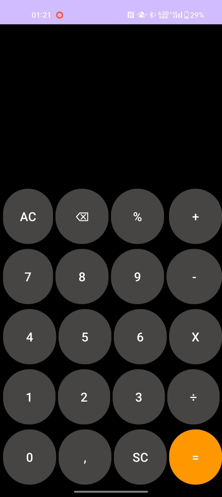
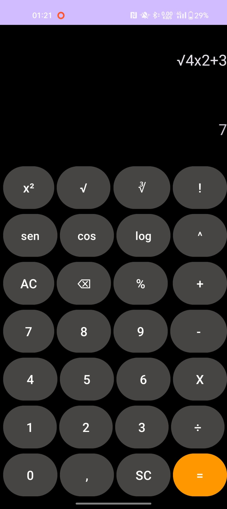

# **Calculator**
This application is a calculator, with many functions, including: basic operations, percentage operations and scientific calculator such as: logarithm, cosine, sine various types of roots, power and factorial, and the use of the comma, in addition to the delete all button and delete one digit at a time and like in the calculators of the phones that by touching in the expression you put the cursor and you can delete from that point, also important in this calculator does the operations in mathematical order

Now there will be some images showing the functions of the calculator

 
 
 
 
 
